# La Méthode IPCRAE : Guide Complet et Vulgarisé

**Version** : 1.0.0
**Date** : 2026-02-22
**Statut** : ✅ Publication
**Lecture estimée** : 45 minutes

---

## 📖 Table des Matières

1. [Introduction : Pourquoi IPCRAE ?](#1-introduction--pourquoi-ipcrae)
2. [Architecture en 3 Couches](#2-architecture-en-3-couches)
3. [Flux de Travail GTD](#3-flux-de-travail-gtd)
4. [Session IA : Le Cycle Magique](#4-session-ia--le-cycle-magique)
5. [Multi-Agent : Collaboration Intelligente](#5-multi-agent--collaboration-intelligente)
6. [Intégration Projet : Mode CDE](#6-intégration-projet--mode-cde)
7. [Git et Synchronisation](#7-git-et-synchronisation)
8. [Cas d'Usage Concrets](#8-cas-dusage-concrets)
9. [Métriques et Amélioration Continue](#9-métriques-et-amélioration-continue)
10. [Guide de Démarrage Rapide](#10-guide-de-démarrage-rapide)

---

## 1. Introduction : Pourquoi IPCRAE ?

### Le Problème 🤯

Imaginez que vous utilisez plusieurs IA différentes (Claude, Gemini, Kilo Code...) pour vos projets. Chaque conversation avec ces IA génère des informations précieuses :
- Décisions d'architecture
- Solutions techniques
- Idées de projets
- Procédures et runbooks

**Le problème** : Une fois la conversation terminée, toutes ces informations sont perdues dans le chat. Vous ne pouvez pas les retrouver, les réutiliser ou les partager avec une autre IA. C'est du **bruit de mémoire**.

### La Solution 💡

IPCRAE (Intelligent Personal Cognitive Resource Architecture Engine) est un système qui :
1. **Capture** toute la connaissance dans des fichiers Markdown
2. **Structure** cette connaissance de manière cohérente
3. **Partage** cette connaissance avec n'importe quelle IA
4. **Versionne** tout avec Git pour ne rien perdre

**Le résultat** : Vous avez un "cerveau" externe qui contient toute votre connaissance, accessible à toutes vos IA.

---

### Les 3 Objectifs Fondamentaux 🎯

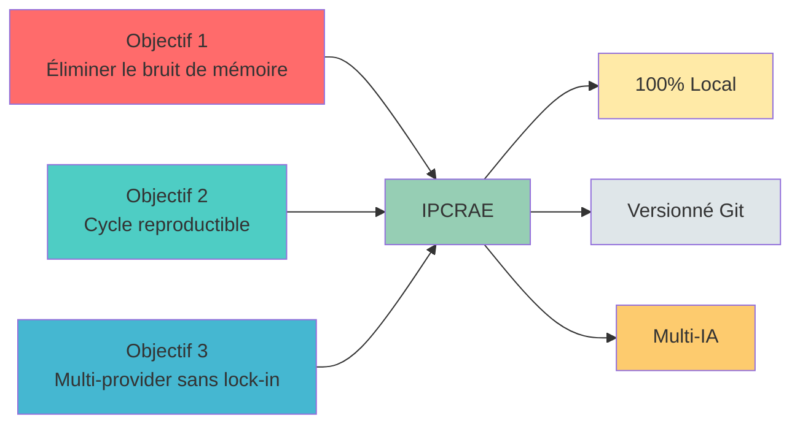

#### Objectif 1 : Éliminer le bruit de mémoire

**Problème** : La mémoire des IA est limitée et volatile. Après quelques jours, vous avez oublié ce que vous avez discuté.

**Solution IPCRAE** : Toute vérité réside dans des fichiers Markdown versionnés avec Git. Si vous oubliez, le fichier se souvient.

#### Objectif 2 : Cycle reproductible

**Problème** : Chaque session IA est différente, difficile à reproduire et difficile à capitaliser.

**Solution IPCRAE** : Un cycle standardisé `start → work → close` qui réduit la charge cognitive et capitalise les apprentissages.

#### Objectif 3 : Multi-provider sans lock-in

**Problème** : Vous êtes dépendant d'un seul fournisseur d'IA et ne pouvez pas changer.

**Solution IPCRAE** : N'importe quelle IA peut lire et écrire dans le même vault avec des contextes normalisés.

---

### Ce que IPCRAE N'EST PAS ❌

| Ce n'est pas... | Explication |
|----------------|-------------|
| Un SaaS multi-tenant | C'est 100% local, aucun serveur externe |
| Un remplacement d'Obsidian | Ça s'intègre à Obsidian, ça ne le remplace pas |
| Une IA autonome | Vous restez maître de la source de vérité |
| Dépendant d'un provider | Ça fonctionne avec Claude, Gemini, Kilo, Codex... |

---

### Pour Qui est IPCRAE ? 👤

**Persona cible** : Praticien solo DevOps/DIY

**Besoins** :
- Gérer plusieurs projets en parallèle (DevOps, électronique, musique, maison...)
- Utiliser plusieurs IA différentes
- Avoir un système léger et rapide
- Avoir tout versionné avec Git
- Avoir une interface CLI intuitive

**IPCRAE est fait pour vous si** :
- ✅ Vous utilisez Obsidian pour gérer vos notes
- ✅ Vous travaillez avec plusieurs IA différentes
- ✅ Vous aimez la ligne de commande
- ✅ Vous voulez que tout soit versionné
- ✅ Vous voulez capitaliser vos apprentissages

---

## 2. Architecture en 3 Couches

IPCRAE repose sur une architecture simple en 3 couches, comme un gâteau en 3 étages 🍰

### Vue d'Ensemble

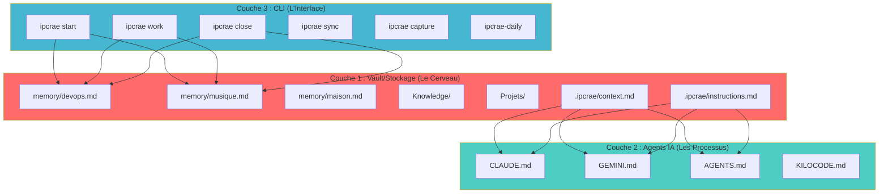

---

### Couche 1 : Vault/Stockage (Le Cerveau) 🧠

**C'est la source unique de vérité** : Tout ce que vous savez est ici.

#### Structure du Vault

```mermaid
graph TD
    ROOT[IPCRAE_ROOT/]
    
    ROOT --> IPCRAE[.ipcrae/]
    ROOT --> MEMORY[memory/]
    ROOT --> KNOWLEDGE[Knowledge/]
    ROOT --> PROJETS[Projets/]
    ROOT --> INBOX[Inbox/]
    ROOT --> CASQUETTES[Casquettes/]
    ROOT --> JOURNAL[Journal/]
    ROOT --> PHASES[Phases/]
    ROOT --> PROCESS[Process/]
    ROOT --> OBJECTIFS[Objectifs/]
    ROOT --> ZETTELKASTEN[Zettelkasten/]
    ROOT --> AGENTS[Agents/]
    ROOT --> PROVIDERS[CLAUDE.md, GEMINI.md, AGENTS.md]
    ROOT --> INDEX[index.md]
    
    IPCRAE --> CONTEXT[context.md]
    IPCRAE --> INSTRUCTIONS[instructions.md]
    IPCRAE --> CONFIG[config.yaml]
    IPCRAE --> PROMPTS[prompts/]
    IPCRAE --> CACHE[cache/tag-index.json]
    IPCRAE --> MULTI[multi-agent/]
    
    MEMORY --> D1[devops.md]
    MEMORY --> D2[musique.md]
    MEMORY --> D3[maison.md]
    MEMORY --> D4[sante.md]
    MEMORY --> D5[finance.md]
    MEMORY --> D6[electronique.md]
    
    MULTI --> STATE[state.env]
    MULTI --> TASKS[tasks.tsv]
    MULTI --> NOTIFICATIONS[notifications.log]
    
    style ROOT fill:#dfe6e9
    style IPCRAE fill:#ff7675
    style MEMORY fill:#74b9ff
    style KNOWLEDGE fill:#55efc4
    style PROJETS fill:#a29bfe
    style MULTI fill:#fdcb6e
```

#### Fichiers Clés

| Fichier | Rôle | Exemple |
|---------|------|---------|
| `memory/devops.md` | Mémoire DevOps consolidée | Décisions d'architecture, patterns, procédures |
| `memory/musique.md` | Mémoire Musique consolidée | Théorie, production, équipement |
| `.ipcrae/context.md` | État actif du système | Projet en cours, phase, identité |
| `.ipcrae/instructions.md` | Règles IA communes | Qualité, vérification, standards |
| `.ipcrae/config.yaml` | Configuration système | Provider par défaut, auto_git_sync |

---

### Couche 2 : Agents IA (Les Processus) 🤖

**C'est l'interface entre le vault et les IA** : Les fichiers que les IA lisent.

#### Fichiers Providers Générés

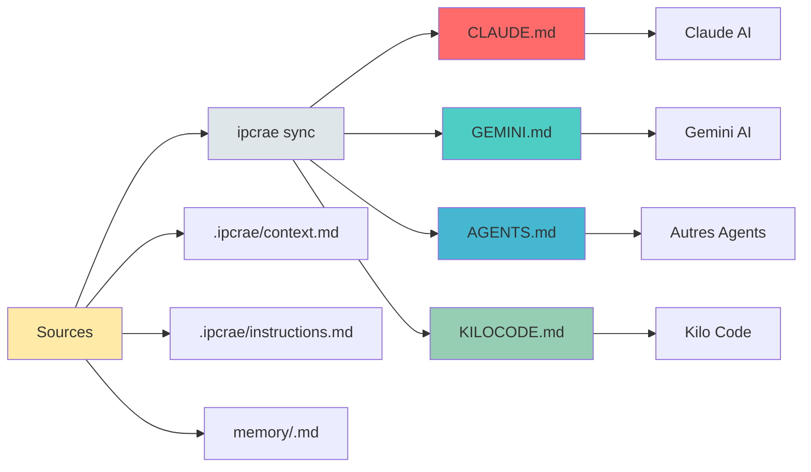

**Important** : Ces fichiers sont **générés automatiquement** par `ipcrae sync`. Ne les éditez pas manuellement !

---

### Couche 3 : CLI (L'Interface) 💻

**C'est votre point d'interaction** : Les commandes que vous tapez.

#### Commandes Principales

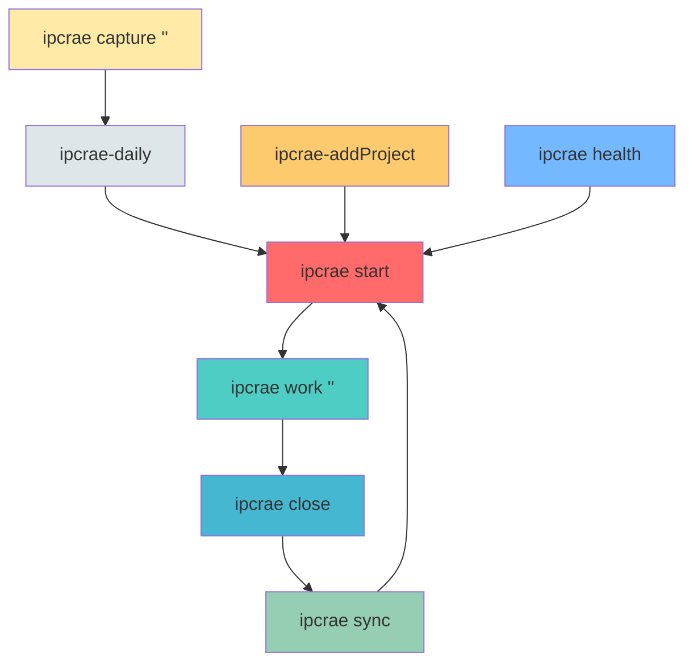

---

### Flux de Données Canonique (Session IA)

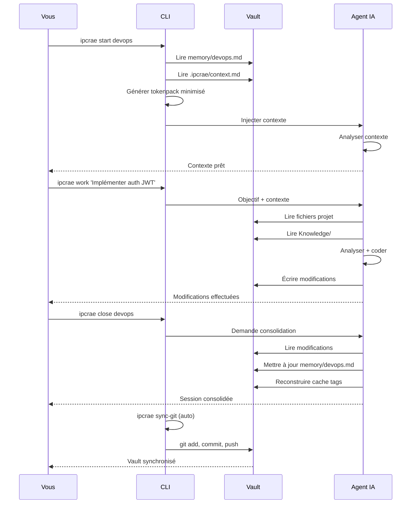

---

## 3. Flux de Travail GTD

IPCRAE intègre la méthode GTD (Getting Things Done) pour gérer vos idées et projets.

### Cycle GTD Complet

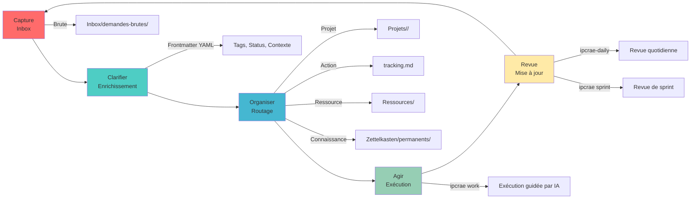

---

### Workflow 1 : Capturer et Traiter une Idée

#### Étape 1 : Capture Sans Friction

Dès qu'une idée survient, capturez-la immédiatement :

```bash
ipcrae capture "Mon idée d'application pour gérer la domotique..."
```

**Ce que ça fait** :
- Crée un fichier `Inbox/capture-<timestamp>.md`
- Ajoute des métadonnées de base
- Vous pouvez continuer sans vous soucier de la structure

#### Étape 2 : Enrichissement Automatisé

Lors de la prochaine revue (GTD), l'IA enrichit automatiquement le fichier avec du frontmatter YAML :

```yaml
---
type: fleeting
status: inbox
tags: [domotique, idee]
created: 2026-02-22
domain: maison
---
```

#### Étape 3 : Routage Décisionnel

L'idée est évaluée et routée automatiquement :

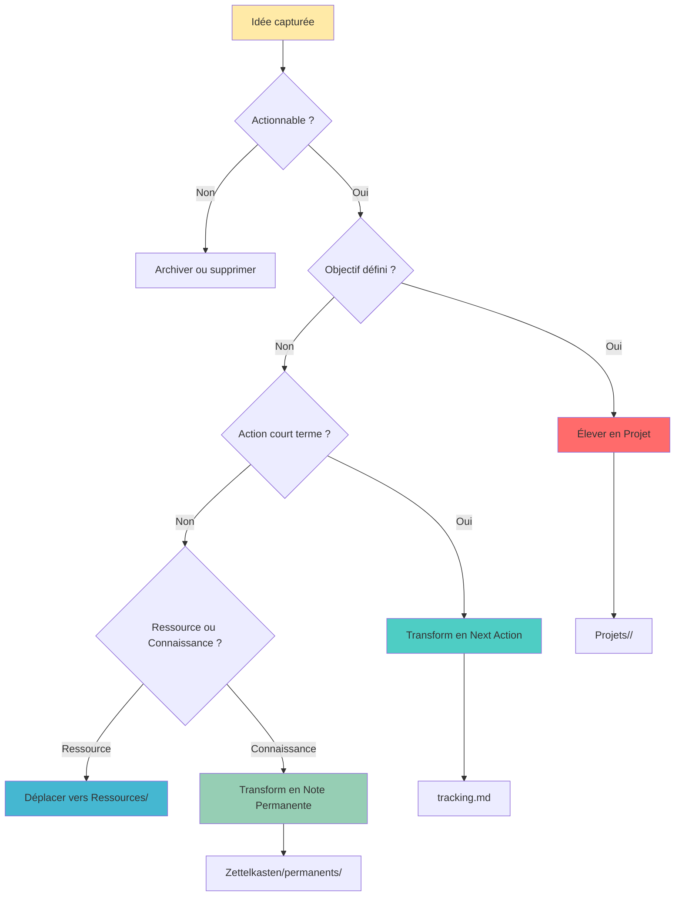

---

### Workflow 2 : Créer un Nouveau Projet

#### Étape 1 : Initialisation

```bash
mkdir -p ~/DEV/MonNouveauProjet
cd ~/DEV/MonNouveauProjet
git init
```

#### Étape 2 : Injection IPCRAE (CDE)

```bash
ipcrae-addProject
```

**Ce que ça fait** :
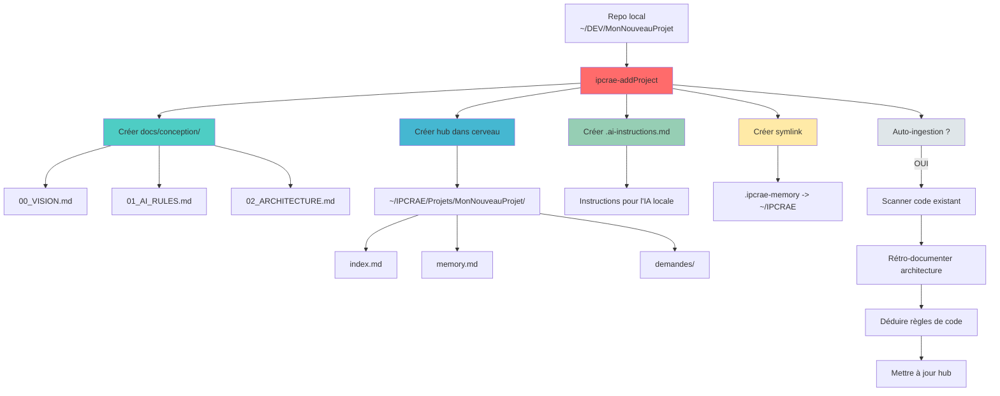

#### Étape 3 : Définition de la Vision

Remplissez `docs/conception/00_VISION.md` avec :
- Le résumé du projet
- Les objectifs
- Les contraintes
- Les livrables attendus

#### Étape 4 : Lancement

```bash
ipcrae sprint --project MonNouveauProjet
```

---

## 4. Session IA : Le Cycle Magique

Le cycle `start → work → close` est le cœur d'IPCRAE.

### Vue d'Ensemble


---

### Phase 1 : START - Initialisation

```bash
ipcrae start devops
```

**Ce qui se passe** :

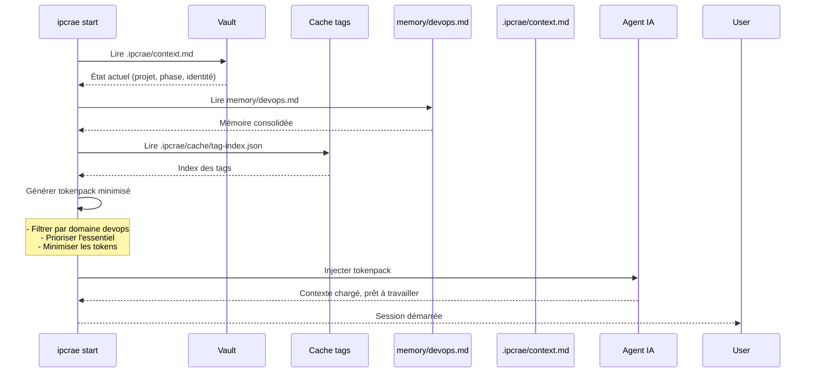

**Tokenpack minimisé** : Un contexte compact contenant uniquement les informations essentielles pour l'IA, optimisé pour réduire la consommation de tokens.

---

### Phase 2 : WORK - Exécution

```bash
ipcrae work "Implémenter l'authentification JWT pour l'API REST"
```

**Ce qui se passe** :

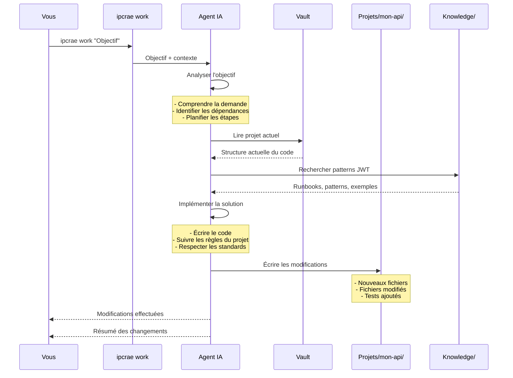

---

### Phase 3 : CLOSE - Consolidation

```bash
ipcrae close devops
```

**Ce qui se passe** :

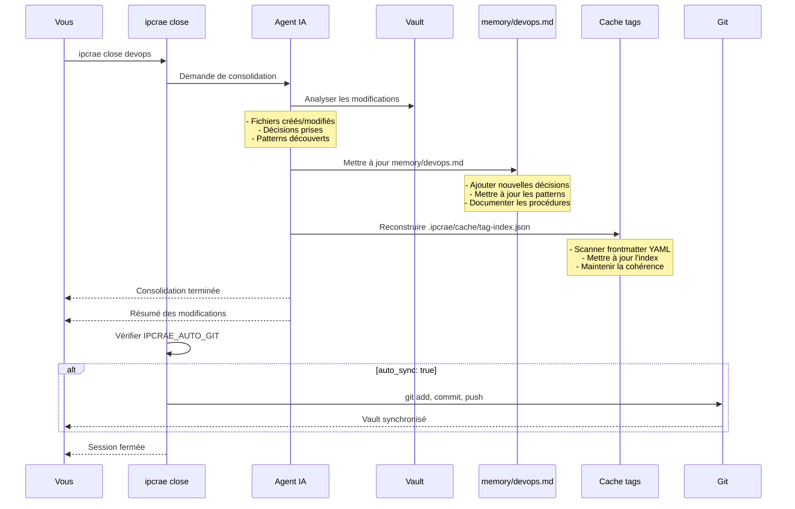

---

### Cycle Complet avec Consolidation

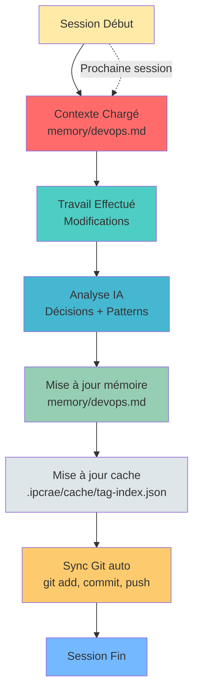

---

## 5. Multi-Agent : Collaboration Intelligente

IPCRAE permet à plusieurs IA de collaborer sur le même projet sans serveur centralisé.

### Architecture Multi-Agent

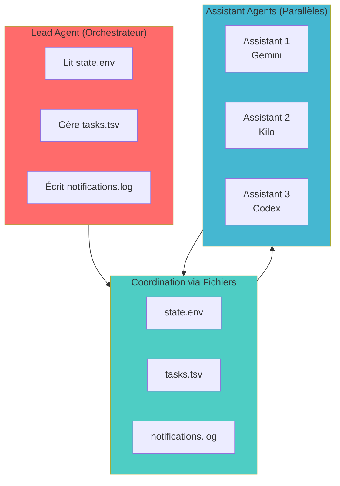

---

### Format des Fichiers de Coordination

#### 1. `state.env` - État de Session

```bash
# Identifiants
SESSION_ID=20250222-210000
SESSION_START=2025-02-22T21:00:00+01:00

# Phase actuelle
PHASE=planning|execution|synthesis

# Agents
LEAD_AGENT=claude
ASSISTANT_AGENTS=gemini,codex,kilo

# Contexte
CURRENT_PROJECT=mon-projet
CURRENT_DOMAIN=devops

# Métriques
TASKS_TOTAL=10
TASKS_COMPLETED=5
TASKS_ACTIVE=3
```

#### 2. `tasks.tsv` - Backlog Partagé

```tsv
ID	STATUS	ASSIGNEE	DESCRIPTION	PRIORITY	CREATED	UPDATED
t1	pending		Analyser architecture	high	2025-02-22	2025-02-22
t2	active	gemini	Implémenter auth JWT	high	2025-02-22	2025-02-22
t3	done	codex	Créer tests unitaires	medium	2025-02-22	2025-02-22
```

**Status possibles** : `pending`, `active`, `done`, `blocked`, `cancelled`

#### 3. `notifications.log` - Historique Inter-Agents

```log
[2025-02-22 21:00:00] [LEAD] Session démarrée. ID: 20250222-210000
[2025-02-22 21:01:23] [LEAD] Tâche t1 créée: "Analyser architecture"
[2025-02-22 21:02:15] [GEMINI] Tâche t2 assignée à gemini
[2025-02-22 21:03:45] [GEMINI] Tâche t2 complétée
```

---

### Flux de Coordination Multi-Agent

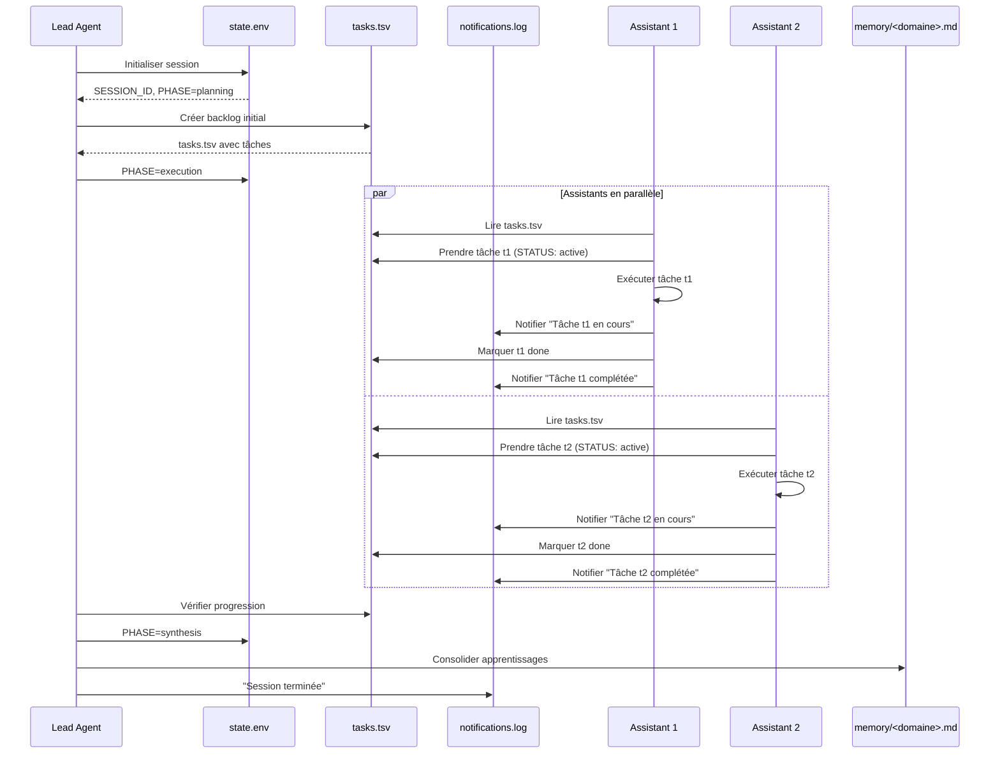

---

### Avantages du Protocole File-Based

| Avantage | Explication |
|----------|-------------|
| **Sans serveur** | Pas de dépendance à un service externe |
| **Versionnable** | L'historique complet est dans Git |
| **Debuggable** | Fichiers texte lisibles par l'humain |
| **Scalable** | Supporte N assistants parallèles |
| **Résilient** | Les fichiers survivent aux crashes agents |
| **Obsidian-friendly** | Intégration directe dans le vault |

---

## 6. Intégration Projet : Mode CDE

Le mode CDE (Context Driven Engineering) permet d'intégrer IPCRAE dans n'importe quel projet existant sans rien casser.

### Flux d'Intégration

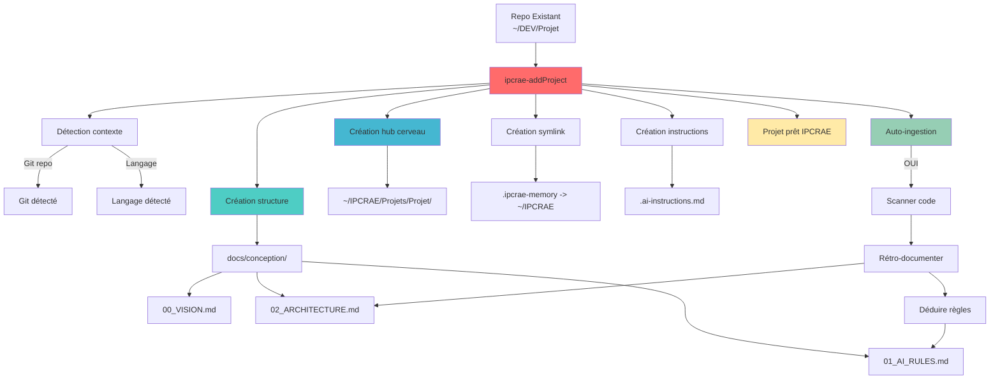

---

### Structure CDE

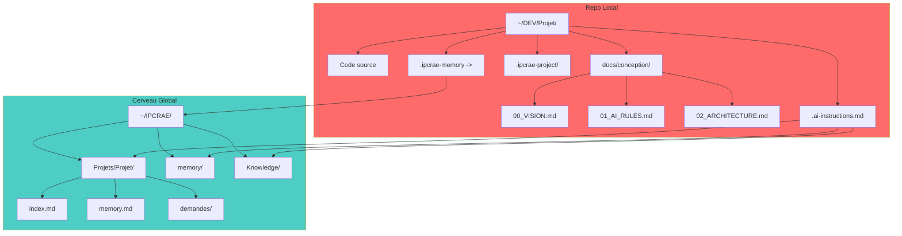

---

### Contrat Bridge (.ai-instructions.md)

```markdown
# Instructions IA pour ce Projet

## Lecture du Contexte
1. Lire `.ipcrae/memory/devops.md` (mémoire globale DevOps)
2. Lire `~/IPCRAE/Projets/Projet/memory.md` (mémoire projet)
3. Lire `docs/conception/02_ARCHITECTURE.md` (architecture locale)
4. Appliquer les règles de `01_AI_RULES.md`

## Écriture dans le Projet
1. Écrire les modifications dans le repo local
2. Documenter les décisions dans `docs/conception/`
3. Mettre à jour la mémoire projet `~/IPCRAE/Projets/Projet/memory.md`
4. Consulter avant de modifier la mémoire globale

## Règles Spécifiques
- Respecter les patterns du projet
- Suivre les conventions de code locales
- Documenter toute modification significative
```

---

## 7. Git et Synchronisation

IPCRAE intègre Git nativement pour synchroniser automatiquement votre vault et vos projets.

### Configuration Git

```yaml
# .ipcrae/config.yaml

# Provider IA par défaut
default_provider: claude

# Synchronisation Git automatique
git:
  # Activer/désactiver la synchro auto
  auto_sync: true
  
  # Remote du cerveau
  brain_remote: origin
  brain_url: https://github.com/vieurou/IPCRAE.git
  
  # Remotes des projets
  project_remotes:
    mon-projet: git@github.com:vieurou/mon-projet.git
  
  # Comportement de commit
  commit:
    template: "[IPCRAE] Auto-sync: {date}"
    exclude:
      - "*.bak-*"
      - ".ipcrae/local-notes/*"
```

---

### Flux de Synchronisation

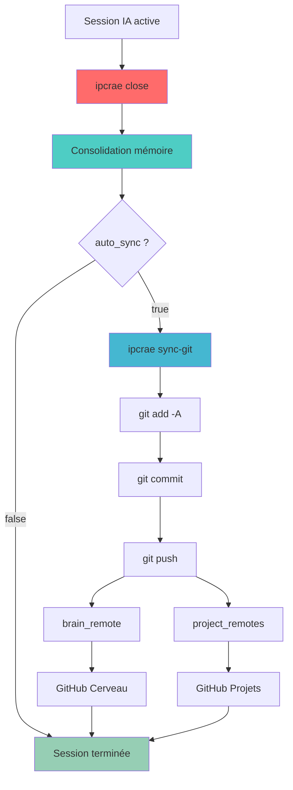

---

### Commandes Git

```bash
# Sauvegarde manuelle
ipcrae sync-git

# Lister les remotes
ipcrae remote list

# Configurer le cerveau
ipcrae remote set-brain <url>

# Configurer un projet
ipcrae remote set-project <slug> <url>

# Visualiser l'historique
git log --oneline --graph
```

---

## 8. Cas d'Usage Concrets

### Scénario 1 : Développer une Nouvelle Fonctionnalité

**Contexte** : Vous développez une API REST et voulez ajouter l'authentification JWT.

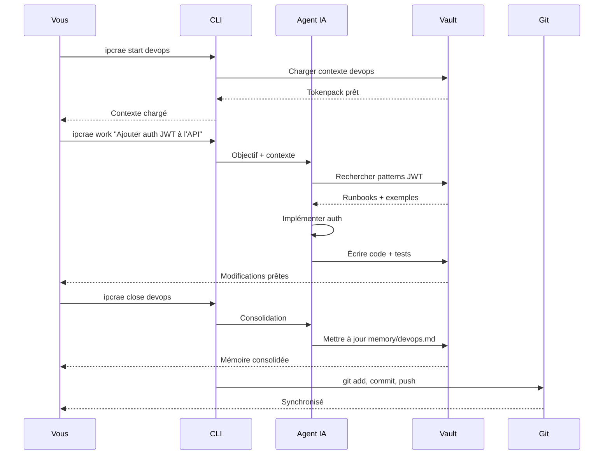

---

### Scénario 2 : Capturer et Traiter une Idée

**Contexte** : Une idée d'application vous vient en tête pendant que vous marchez.

```mermaid
graph LR
    IDEA[Idée spontanée] --> CAPTURE[ipcrae capture]
    CAPTURE --> INBOX[Inbox/capture-<timestamp>.md]
    
    INBOX --> DAILY[ipcrae-daily]
    DAILY --> ENRICH[Enrichissement IA]
    ENRICH --> YML[Frontmatter YAML]
    
    YML --> DECISION{Routage}
    
    DECISION -->|Projet| PROJET[Projets/mon-app/]
    DECISION -->|Connaissance| ZETTEL[Zettelkasten/permanents/]
    DECISION -->|Action| TRACKING[tracking.md]
    
    PROJET --> CREA[Création projet CDE]
    CREA --> CODE[Développement IA]
    
    style IDEA fill:#ffeaa7
    style CAPTURE fill:#ff6b6b
    style DAILY fill:#4ecdc4
    style DECISION fill:#45b7d1
    style PROJET fill:#96ceb4
```

---

### Scénario 3 : Collaboration Multi-Agents

**Contexte** : Vous voulez qu'un agent analyse l'architecture pendant qu'un autre implémente les tests.

```mermaid
sequenceDiagram
    participant Lead as Lead (Claude)
    participant Files as Fichiers partagés
    participant A1 as Assistant 1 (Gemini)
    participant A2 as Assistant 2 (Kilo)
    participant Memory as memory/
    
    Lead->>Files: Créer tasks.tsv
    Note over Files: t1: Analyser architecture<br/>t2: Implémenter tests
    
    par En parallèle
        A1->>Files: Prendre tâche t1
        A1->>A1: Analyser architecture
        A1->>Files: Marquer t1 done
    and
        A2->>Files: Prendre tâche t2
        A2->>A2: Implémenter tests
        A2->>Files: Marquer t2 done
    end
    
    Lead->>Files: Vérifier progression
    Lead->>Memory: Consolider apprentissages
    Lead->>Files: Session terminée
```

---

## 9. Métriques et Amélioration Continue

### Score IPCRAE Actuel

```
Score Global : 35/40 (87.5%)
├─ Documentation conception : 14/15 (93.3%)
├─ Workflows : 5/5 (100%)
├─ Scripts CLI : 10/10 (100%)
├─ Templates : 5/5 (100%)
├─ Cohérence VISION/ARCHITECTURE : 2/2 (100%)
├─ Cohérence ARCHITECTURE/Workflows : 1.75/2 (87.5%)
└─ Cohérence Workflows/Scripts : 1/1 (100%)
```

### Évolution du Score

```mermaid
graph LR
    A[2026-02-21<br/>30/40 (75%)] --> B[2026-02-22<br/>35/40 (87.5%)]
    B --> C[Objectif<br/>40/40 (100%)]
    
    style A fill:#ff6b6b
    style B fill:#4ecdc4
    style C fill:#96ceb4
```

### Audit de Non-Régression

Le script `scripts/audit_non_regression.sh` vérifie :
- ✅ Intégrité des fichiers (Markdown, Shell, tests)
- ✅ Intégrité des mémoires (projet et global)
- ✅ Intégrité des scripts
- ✅ Intégrité des templates
- ✅ Commits Git
- ✅ Cohérence des tags
- ✅ Liens entre fichiers
- ✅ Références valides

### Mode Auto-Amélioration

Le mode auto-amélioration est activé par défaut. L'IA propose automatiquement des améliorations après chaque session.

---

## 10. Guide de Démarrage Rapide

### Installation

```bash
# Cloner le repo
git clone https://github.com/vieurou/IPCRAE.git ~/IPCRAE
cd ~/IPCRAE

# Exécuter l'installateur
./ipcrae-install.sh
```

**Ce que ça fait** :
- Installe les scripts dans `~/bin`
- Configure les liens symboliques
- Initialise le vault
- Configure Git

---

### Premiers Pas

#### 1. Vérifier l'installation

```bash
ipcrae health
```

**Attendu** :
```
✅ IPCRAE installé et fonctionnel
✅ Vault accessible
✅ Scripts installés
✅ Git configuré
```

#### 2. Capturer une idée

```bash
ipcrae capture "Mon idée de projet..."
```

#### 3. Lancer une session IA

```bash
ipcrae start devops
ipcrae work "Mon objectif"
ipcrae close devops
```

#### 4. Faire une revue quotidienne

```bash
ipcrae-daily
```

---

### Commandes Essentielles

| Commande | Description |
|----------|-------------|
| `ipcrae start <domaine>` | Démarrer une session IA |
| `ipcrae work "<objectif>"` | Travailler avec l'IA |
| `ipcrae close <domaine>` | Fermer et consolider la session |
| `ipcrae capture "<idée>"` | Capturer une idée rapidement |
| `ipcrae-daily` | Revue quotidienne GTD |
| `ipcrae health` | Vérifier l'état du système |
| `ipcrae sync` | Régénérer les fichiers providers |
| `ipcrae addProject` | Intégrer un projet existant |

---

### Ressources

- **Documentation complète** : `docs/conception/`
- **Workflows** : `docs/workflows.md`
- **Référence des commandes** : `docs/conception/08_COMMANDS_REFERENCE.md`
- **Synthèse vision/architecture** : `docs/conception/07_VISION_ARCHITECTURE_SYNTHESIS.md`
- **Audits** : `docs/audit/`

---

## Conclusion

IPCRAE est un système complet pour gérer votre connaissance et vos projets avec l'aide de l'IA. Il repose sur 3 principes fondamentaux :

1. **Éliminer le bruit de mémoire** : Tout est dans des fichiers versionnés
2. **Cycle reproductible** : start → work → close → consolidation
3. **Multi-provider sans lock-in** : Fonctionne avec n'importe quelle IA

**Score actuel** : 35/40 (87.5%)
**Objectif** : 40/40 (100%)

**Prochaines étapes** :
- [ ] Atteindre le score parfait
- [ ] Ajouter tests GTD complets
- [ ] Améliorer l'accessibilité pour les nouveaux utilisateurs
- [ ] Créer tutoriels vidéo optionnels

---

**Pour aller plus loin** :
- [ ] Lisez `00_VISION.md` pour comprendre la vision
- [ ] Lisez `02_ARCHITECTURE.md` pour comprendre l'architecture
- [ ] Lisez `workflows.md` pour comprendre les workflows
- [ ] Utilisez `ipcrae health` pour vérifier votre installation

---

**Auteur** : Éric V.
**Version** : 1.0.0
**Date** : 2026-02-22
**Licence** : MIT

---

**End of Document** 🎉